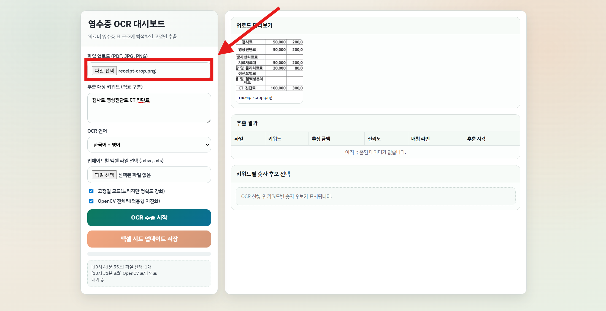
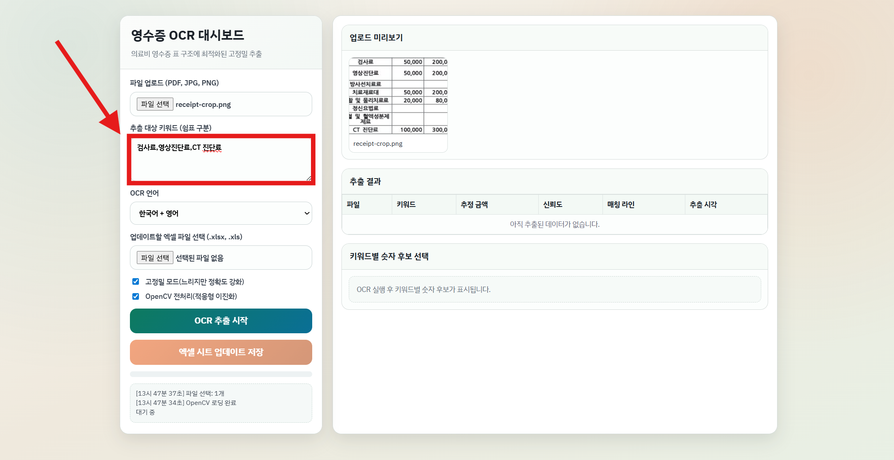
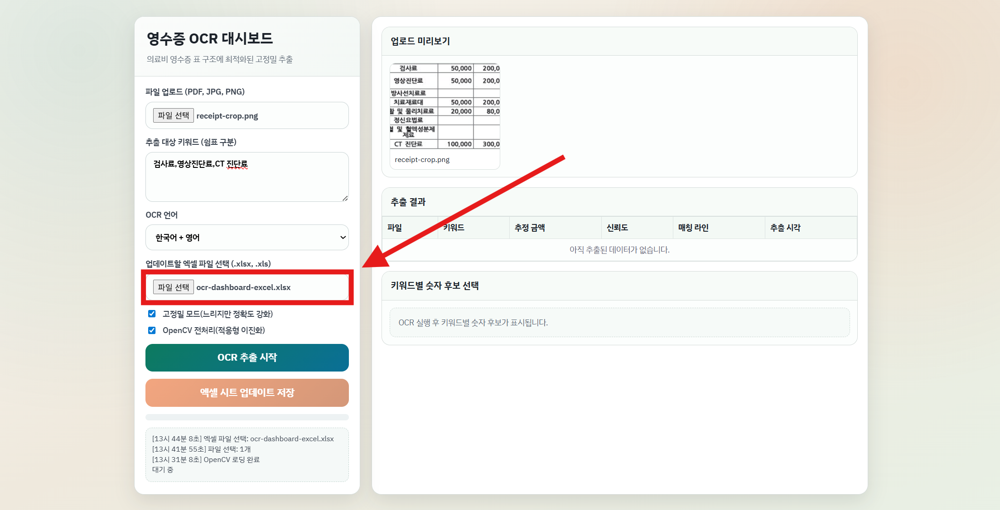
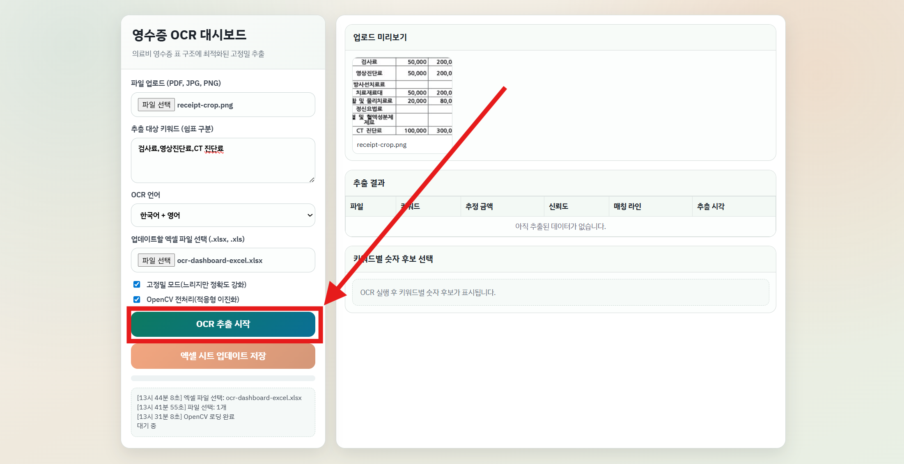
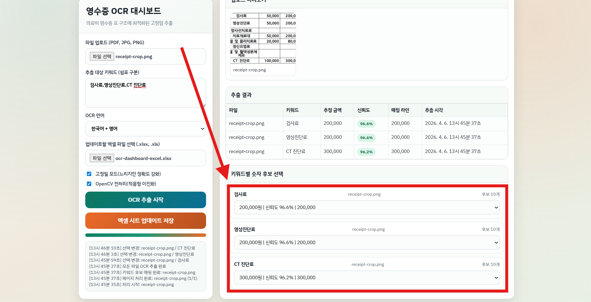
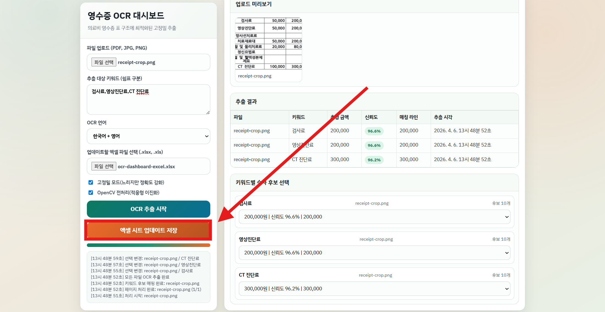
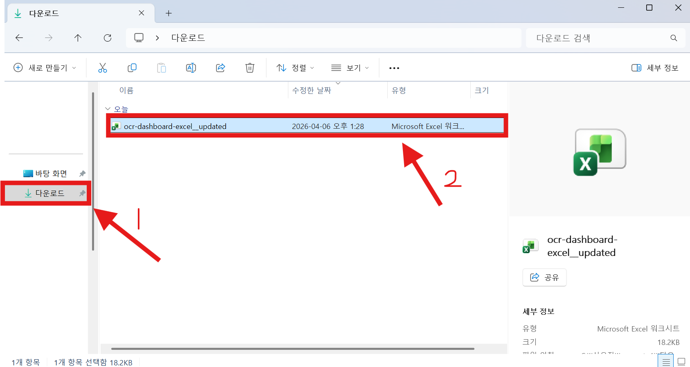

# Application Flow

애플리케이션 사용 흐름입니다.

## Step 01

이미지 분석에 사용할 파일을 선택합니다.

## Step 02

추출할 대상 키워드(예 : 합계, 엑스레이 검사)를 입력합니다. 

## Step 03

업데이트할 엑셀 파일을 선택합니다.

> [!NOTE]
> HTML 파일만을 사용해 브라우저에서 "이런 게 가능하다"를 보여주는 애플리케이션인만큼, 엑셀 파일을 덮어씌우지는 못합니다(파일 시스템 특성상).

## Step 04

`OCR 추출 시작` 버튼을 클릭해 텍스트 추출을 진행합니다.

## Step 05

각 키워드별로 값이 일치하지 않는다면 수정합니다.

> [!TIP]
> 테스트 결과, 클라우드 OCR 서비스들의 API를 사용하면 99% 정확도로 모든 숫자들을 인식하고 각 위치에 맞춰 사용할 값들만 처리하도록 워크플로우를 만들 수 있는데, 이를 사전 배경 지식이 없는 사람들을 대상으로 서비스 없이 로컬에서 구현하라고 하면 어려워보임

## Step 06

`엑셀 시트 업데이트 저장` 버튼을 클릭해 업데이트된 엑셀 파일을 다운로드 받습니다.

## Step 07

`다운로드` 폴더에서 다운받은 엑셀 파일을 확인합니다.

